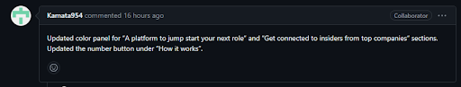
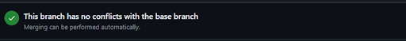
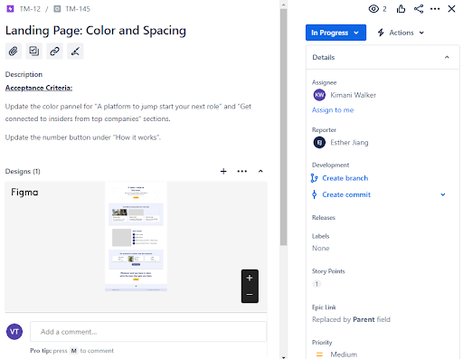
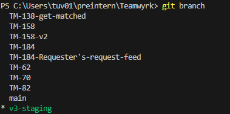
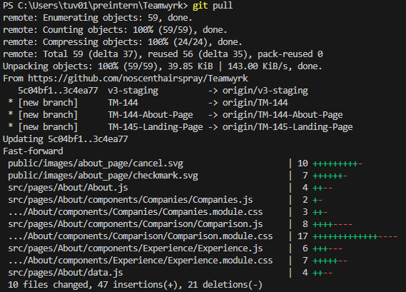
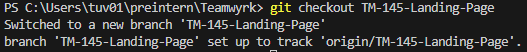
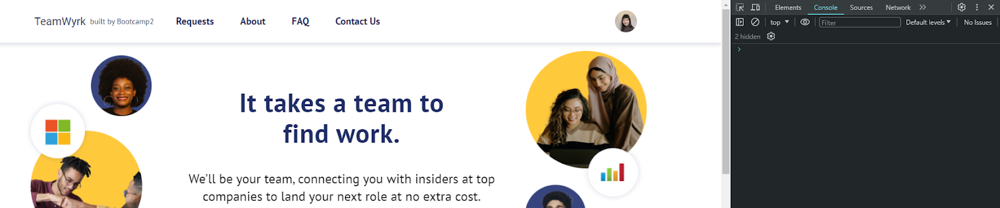
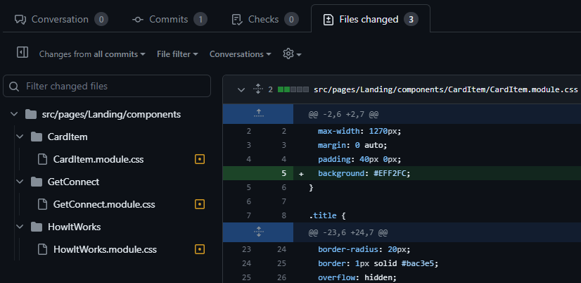
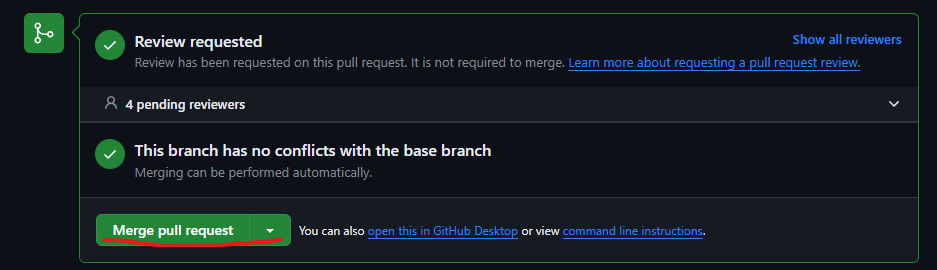

# Guildelines for reviewing pull requests on Github

**These are just general guildelines. They need not be strictly followed**

1. With the pull request open, check if the branches are correct.

2. Read the description to understand the pull request

3. Check if the branch has any merge conflicts

    1. If there are merge conflicts, then fix those accordingly. Solving it will depend on what the conflicts are. Usually, it’s because the new branch was copied from the wrong branch or the new branch was created before pulling from the original branch. You can ask for help from other devs to fix the conflicts if you’re unsure.

2. Find the ticket on Jira

5.  Read the ticket description to understand the changes required. If the ticket is frontend related, then a Figma design should be attached.

6.  Open the codebase on your computer. In your command line, make sure you’re on the correct version branch: `git branch`

7.  To get all remote branches: `git pull`

8.  Switch to the branch you’re reviewing: `git checkout <branch-name>`

9.  Start up the website: `npm start`

10. Make sure the website starts correctly and there are no errors.

    1. If it starts up correctly:

       1. Open the Inspect console in the browser

       

       2. Open all the files that were changed on VSCode or any other editor you use. You can find these files on Github in the pull request. You can also look at these changes side by side on Github if you click the gear logo and change the view
          

       3. If the ticket is frontend, compare the website to the designs on Figma. Then compare the code to Figma designs. If you click on the container in Figma, it will give you the layout, as well as colors, fonts, etc

       4. If the ticket is more than cosmetic, then test the code to make sure everything works and does what it’s supposed to. The inspect console on the browser will let you know if there are any errors or if there are any console.logs() that need to be removed.

       5. Add a comment to the pull request on Github if there are any changes that need to be done. If there are no changes and everything works, add a comment to the document that you checked, then merge the request if there are no other reviewers.

       

    2. If it doesn't start up correctly, then there are issues that need to be resolved. Make sure you can start up the current version's branch without any issues. This eliminates a longer debugging process, since the current version's branch should start up with no problems.

Done!
